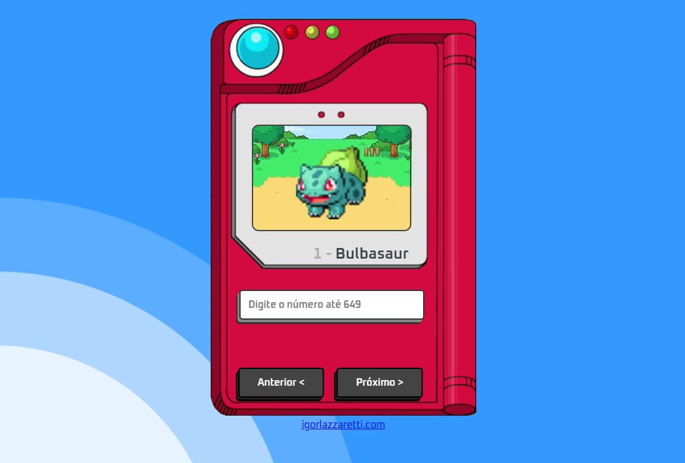

## Minha Pokedex

 
   

  

Aprendendo a consumir uma api na temática de Pokemon.

## Sobre o Curso
Esta Pokédex, desenvolvida com JavaScript, utiliza uma API externa para fornecer informações de nome e imagem sobre cada Pokémon. Explore a vasta gama de criaturas e mergulhe no mundo Pokémon como nunca antes. Este projeto representa meu primeiro contato com o desenvolvimento backend e consumo de APIs, marcando o início da minha jornada no mundo backend da programação.

Aqui está o deploy do projeto: [Caderno](https://igorlzzrtt.notion.site/Node-js-16157f4b771580f581e7d72f4e560650)

## Tecnologias Utilizadas

## Sobre o Desenvolvedor

🎓 Análise de Sistemas - Cruzeiro do Sul  
💻 Estudante FullStack: DevClub / Dio.me 
👩🏻‍💻 Autor do Site: <a href="https://igorlazzaretti.com/">igorlazzaretti.com</a>  
📚 Leitor e Estudante de Inglês  
🧙‍♂️ Fã de Harry Potter     
💾 <a href="https://github.com/igorlazzaretti?tab=repositories">Veja todos meus repositórios</a>   

##

> "Acredite nos seus sonhos"   - Igor Dossin Lazzaretti

